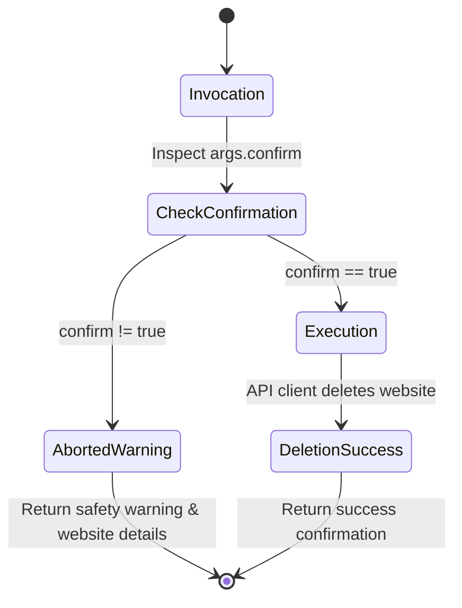

# Data Model: Agent MCP Server for Deployed Application

## Entities & Interfaces

### 1. Tracked Website (`Website`)
Represents an individual web property registered in the analytics system.

| Field | Type | Required | Description |
| :--- | :--- | :---: | :--- |
| `id` | `UUID / string` | Yes | Unique system identifier for the website |
| `name` | `string` | Yes | Display name (max 100 characters) |
| `domain` | `string` | Yes | Fully qualified domain name or hostname (e.g. `example.com`) |
| `shareId` | `string \| null` | No | Public share identifier if sharing is enabled |
| `resetAt` | `ISO 8601 string \| null` | No | Timestamp of last metric reset |
| `teamId` | `UUID / string \| null` | No | Identifier of the team owning the website, or null if user-owned |
| `createdAt` | `ISO 8601 string` | Yes | Timestamp of website creation |
| `updatedAt` | `ISO 8601 string` | No | Timestamp of last modification |

#### Associated Computed Entity: `TrackingSnippet`
Generated tracking script metadata provided to agents for rapid deployment.

| Field | Type | Description |
| :--- | :--- | :--- |
| `websiteId` | `string` | Identifier matching `Website.id` |
| `scriptUrl` | `string` | Absolute URL to the tracker script (e.g. `https://analytics.mjmiller.cloud/script.js`) |
| `htmlTag` | `string` | Complete HTML `<script>` tag ready for embedding |

---

### 2. Website Creation & Modification Payloads

#### `CreateWebsiteInput`
| Field | Type | Required | Validation Rules |
| :--- | :--- | :---: | :--- |
| `name` | `string` | Yes | Non-empty, max 100 characters |
| `domain` | `string` | Yes | Valid hostname / domain format, max 500 characters |
| `teamId` | `string` | No | Valid UUID if provided |

#### `UpdateWebsiteInput`
| Field | Type | Required | Validation Rules |
| :--- | :--- | :---: | :--- |
| `websiteId` | `string` | Yes | Must reference an existing, authorized website |
| `name` | `string` | No | Non-empty, max 100 characters |
| `domain` | `string` | No | Valid domain format |

#### `DeleteWebsiteInput`
| Field | Type | Required | Validation Rules |
| :--- | :--- | :---: | :--- |
| `websiteId` | `string` | Yes | Must reference an existing, authorized website |
| `confirm` | `boolean` | No | If `false` or omitted, action is aborted with warning |

---

### 3. Analytics Metric Summary (`WebsiteStats`)
Aggregated traffic metrics for a website across a specific time range.

| Field | Type | Description |
| :--- | :--- | :--- |
| `pageviews` | `number` | Total pageviews recorded in interval |
| `visitors` | `number` | Unique visitors count |
| `visits` | `number` | Total visitor sessions |
| `bounces` | `number` | Sessions with single pageview |
| `totaltime` | `number` | Aggregate duration across all visits (in seconds) |
| `prev` | `object \| null` | Metrics from the equivalent previous time period for delta comparison |

---

### 4. Categorical Breakdown (`MetricItem`)
Ranked distributions of specific visitor dimensions.

| Field | Type | Description |
| :--- | :--- | :--- |
| `x` | `string` | Dimension value (URL path, referrer hostname, country code, device type, OS, etc.) |
| `y` | `number` | Total count for this dimension value |

---

### 5. Realtime Snapshot (`RealtimeActivity`)
Live activity on the website within the last 5 minutes.

| Field | Type | Description |
| :--- | :--- | :--- |
| `websiteId` | `string` | Identifier of the website |
| `visitors` | `number` | Number of active unique visitors |
| `views` | `number` | Number of active pageviews |
| `paths` | `Array<{ path: string, visitors: number }>` | Currently viewed URL paths and user counts |

---

### 6. Destructive Action Confirmation Guardrail

State transition for destructive operations (`delete_website`):

